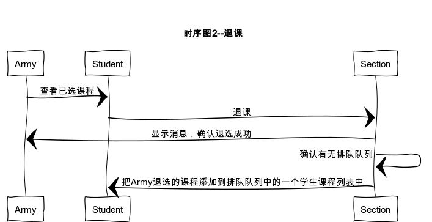
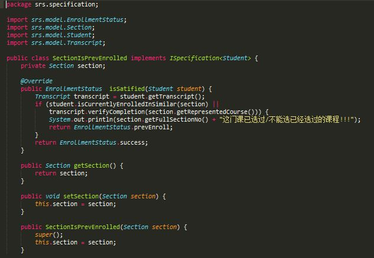
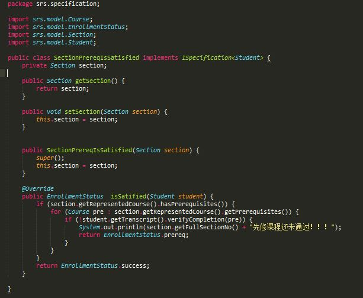
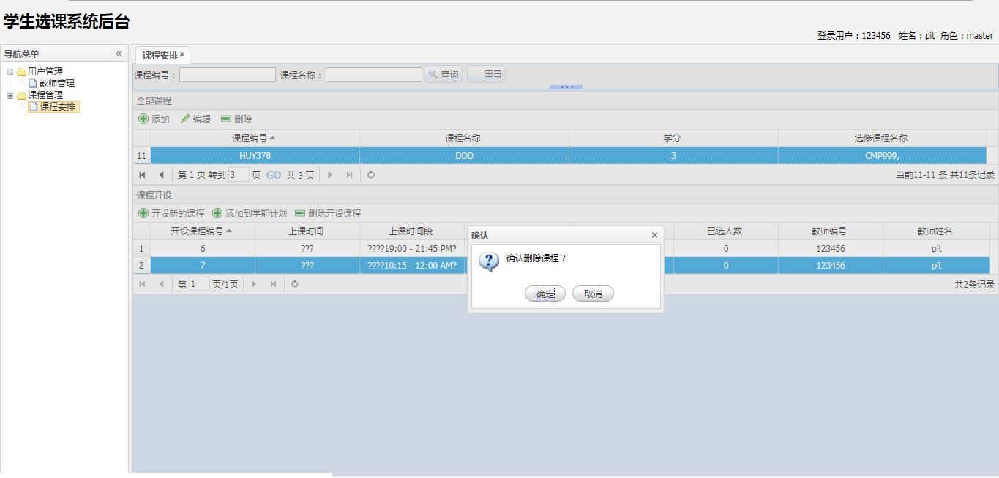
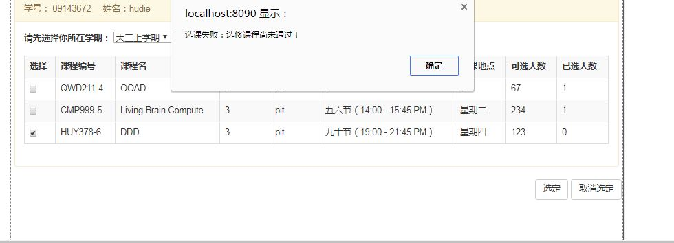

# FinalProject

  <h3>1、类图/时序图</h3>
  
  
  
  

  
  <h3>2、数据库结构图/项目结构图</h3>
   
   
  

  
  <h3>3、项目介绍</h3>
    <h4>3.1、改进的地方</h4>
      <h5>3.1.1、增加了一个BaseDao作为所有dao的父类，利用对象的多态来减少工厂代码量，使得数据源的切换更加灵活</h5>
        
      <h5>3.1.2、增加Person对象，让学生和教师继承自它，让登录更加方便灵活</h5>
        
       <h5>3.1.3、规格</h5> 
         <h6>3.1.3.1、规格接口</h6>
         
         <h6>3.1.3.2、规格实现</h6>
         
         
         
         <h6>3.1.3.3ArrayList<ISpecification>规格在section类中的实现和应用</h6>   
         
      <h5>3.1.4、工厂方法</h5> 
            
    <h4>3.3、waitList</h4>
         
         
    <h4>3.2、功能实现及代码</h4> 
      <h5>3.2.1、登录</h5>
          
      <h5>3.2.2、教师管理之增删改查</h5>
          
          
          
          
      <h5>3.2.3、课程管理（包括设置先修课程）和开设课程管理</h5>
        <h5>3.2.3.1、课程管理</h5> 
          
          
          
        <h5>3.2.3.2、课程管理下的开设课程管理</h5> 
          
          
        <h5>3.2.3.3、添加开设课程管理到学期</h5> 
          
      <h5>3.2.4、选课</h5>
         <h5>3.2.4.1、选课成功</h5>
          
         <h5>3.2.4.3、选课失败</h5>
          
          
      <h5>3.2.5、选课查看/退选</h5>
          
      <h5>3.2.6、成绩查看</h5>
          
  <h3>4、说明</h3>
    大多方法都是写在CourseImpl中
  方法 
